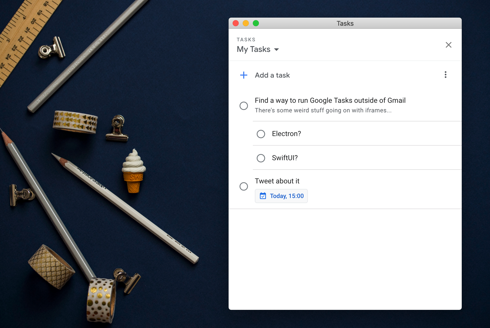

# Google Tasks for Mac

Google Tasks has some pretty good mobile apps. However, there's no native Mac app yet. This application is a tiny wrapper around the Google Tasks widget that's embedded in Gmail and Google Calendar.

[Download the latest release]()

## Contributing

Google Tasks for Mac uses nativefier and electron under the hood to create a browser window that loads Google Tasks and injects some javascript to make it actually work.

Feel free to open issues with new ideas or open pull requests with new features.

## Building

- `yarn install`
- `yarn build`
- output will be in the `Google Tasks-darwin-x64` directory

## Disclaimer

I'm not related to Google whatsoever and just built this for fun. Get in touch if your concerned:

alex.vanderbist@gmail.com
or @alexvanderbist on twitter.